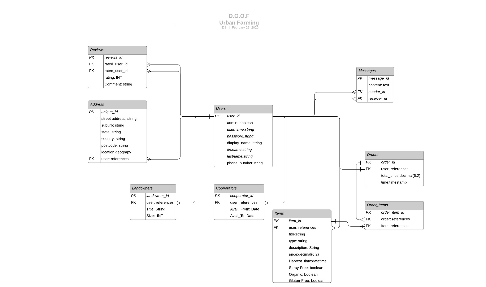

# README

## **Configuration**
    1. bundle install
-----
### R1: Ruby version
- ruby 2.6.5p114
- Rails 5.2.4.1
-----
### R2: PostgreSQL version
- psql (PostgreSQL) 12.2 
-----
### R3: Devise version
 - devise (4.7.1)
-----
### R4: Authorisation
Users must sign up and login before having the ability to trade and share within the app. (No sidebar)
If an admin user enters their credentials

-----------

### R5: Uploading Images
Uploading images on the cloud is a requirement for this application, and even though Amazon Web Services was recommended, I did not feel like their business model - taking military contracts - is in the spirit of this application's ideals. 
>Amazon is the leading cloud provider for the United States intelligence community. In 2013, Amazon entered into a $600 million contract with the CIA to build a cloud for use by intelligence agencies working with information classified as Top Secret. Then, in 2017, Amazon announced the AWS Secret Region, which allows storage of data classified up to the Secret level by a broader range of agencies and companies. Amazon also operates a special GovCloud region for US Government agencies hosting unclassified information.
Currently, Amazon is one of the leading contenders for an up to $10 billion contract to build a private cloud for the Department of Defense.
https://wikileaks.org/amazon-atlas/

(Discussed later in R7 & R8)
Users are able to upload images if they are signed in, by clicking on "Sell" then "Add Produce" they are able to select "Browse...".
This uses [cloudinary](https://cloudinary.com/) gem to upload the images.

-----

### R6: Hosting Online
This is not completed due to not being able to find a good free hosting site that requires a visa card. 
1. AWS - Requires Credit Card.
2. Cloudinary addon in Heroku Requires Credit Card.
Sorry I do not have a credit card for these purposes right now. 
**I did however setup the cloudinary settings in my code, all thats needed is to pay for it on Heroku.**

-----

### R7: Identification of the problem you are trying to solve by building this particular marketplace app.

For over a decade now, the Australia's Fast-moving consumer goods (FMCG) sector has been in the grip of an ever-strengthening monopoly.
The two leading supermarkets in Australia today both started in the year 1914. 
- *Coles*, was merged with *Myer Emporium Ltd* in 1985, then becoming known as Coles Myer.
Today Coles has over 100,000 employees and, together with "rival" Woolworths, accounts for more than 80 per cent of the Australian market.
- *Woolworths*, owned by *Westfarmers* was originally a cooperative company created by an association of farmers from Western Australia known as the "Western Australian Farmers Federation"
    - They would distribute wheat, british oil, lifestock and by 1919 it had 64 other cooperative companies under its wing. 
    - They started the beginnings of the ABC and the Australian National Party. 

On 2 July 2007, Coles Group Limited (Coles) and Wesfarmers Limited (Wesfarmers) announced a proposal for Wesfarmers to acquire Coles. This was implemented on 23 November 2007 purchising Coles for $19.3 billion, the biggest corporate takeover in Australia's history.

This means that 80% of the food distribution in Australia comes under the roof of one company, a company which also owns Bunnings, Kmart, Target, Officeworks, Dan Murpheys among many others...
This kind of monopoly on virtually all the major industries have created an impalance of power which allows Westfarmers to bankrupt smaller brands and companies by lowering their prices. 
Rather than reducing operating costs to fund the lower prices, such as stocking pallets on the floor like Aldi, Coles and Woolworth have focused on reducing the price they pay for goods. 
This means the farmers that was once helped by this association is now able to demand whatever low prices they want, and farmers that want to stay in the business are forced to sell at that price.

----- 

### R8: 	Why is it a problem that needs solving?

1. **Centralisation of Power & Resources**
*"Power Corrupts, Absolute Power Corrupts Absolutely"*
Apart from the obvious reasons why its a bad idea to consolidate power that way...lets talk about the Centralised distribution networks. 
Australia is a country inundated with all kinds of natural disasters, from bush fires to tsunamis to cyclones and floods, there are many ways that the distribution network can be disrupted.
Coronavirus is just the latest of these incidents that could very well get out of control and possibly create a state food insecurity in great regions across Australia (and the world).  
Its not unheard of that Australian residents have spent two weeks without power after a cyclone, or that trucks can't pass through certain areas after a flood. 
Currently the Australian government advises people to keep "reasonable stocks" of non-perishable foods so that in the event of a disaster, people wont starve. 
That means the responsibility for food security is not really in the hands of our government, it is supposed to be in the hands of the people. 
But today, we have a single point of failure in 80% of the food supply in Australia, a single point of failure called Westfarmers and our oil reserves. 
If Australia was unable to import oil from tomorrow onwards, we would run out of petrol within a couple of weeks. 
This is why it is imperitive that the people find ways of creating their own food security by growing locally and decentralising food distribution. 

2. **Pesticides Monocultres and the Agrochemical Farming Model**
- *Profit Driven Farming*
Since the end of the Vietnam war, chemical manufacturers that used to make chemcicals for war rebranded to make chemicals for agriculture. 
Pesticides such as the herbicide Roundup allowed increased profits for farmers in the west where labour costs are very high. They are now able to just spray their fields instead of weeding them. But alas, the weeds became resistant to the active ingredient called Glyphosate.
The solution came in the form of Genetically Modified Organisms (GMOs) that were made to be resistant to Glyphosate, aka, "Roundup Ready" 
This caused unprecidented spikes in the amount of pesticides sprayed directly on food, rapidly causing accumulations in the environment, and in our bodies.
In order to use machines at large scales the western agricultural model have employed very few seed varieties and planting them in monocultures so that they can be harvested en masse. 

- *Results*
The result of this style of farming, which is unprecedented in the history of human civilisation, starts in the soils. 
First because we dont rotate crops enough and the fields lack diversity, the soils become depleted in certain essential nutrients, which ends up growing weak plants that are more susceptible to pests. 

Weeds start to grow, so we spray compounds like glyphosate on it, which, before it was marketed as a herbicide was actually discovered to be an antibiotic. The same shikimate pathway that it uses to kill plants also kills bacteria, the powerhouse of the soils. This causes further degradation of the soils, growing even weaker and less nourished plants. 

In order to cater for the vast distances that the food then needs to travel to make it to the supermarket shelves we harvest them weeks too early, before they have had a chance to attain their full nutrient load. 
End the end, we end up with foods that lack essential minerals like magnesium, lack nutrients and lack taste.  

3. **Economical Monopoly on Food Distribution**
Not only does this consolidation breed corruption through the imbalance of power, but it also results in an overall loss of profit to the producers and opportunities to the Australian processors and distributors. 
Shop owners and Australian brands find it impossible to co-exist with massive conglomorates like westfarmers, leading thhem to sell out or die out.  

-----

### R9: URL To online App:

N/A (Refer to R6)

### R10: Github Link:
 

[GitHub - Urban Farmer](https://github.com/DaAxe/Urban_Farmer)

### R11: Description of your marketplace app (website):
- Purpose
This application is designed for property owners to get the maximum benefit out of their free land, for consumers to get good quality local produce readily and for anyone who has free time to collaborate on building productive gardens. This is done with the hope that we can make it easier to create food security in localities while promoting high quality, low toxin produce. 

- Functionality / features

    - For users to be able to 
        - authenticate users before they join the app
        - *buy* in an online market, with a map functionality so that one can find the most local produce available
        - *sell* produce which have been grown on ones property, as a cooperative or independently
        - *host* land for use, if one would like to create a team for building a garden
        - *cooperate* with land hosts to build gardens, sharing the produce once harvest time comes
    - Yet to Implement
        - Group Chat Functionality
        - Rating system
        - Skilled Mentors & Workshops section
- Sitemap
    
 

- Screenshots

 
 
 
 

- Target audience
1. Anyone who wants to buy local produce.
2. Anyone who wants to grow produce locally.
3. Anyone who wants to collaborate on gardens and workshops.
4. Anyone who has land to share.

- Tech stack (e.g. html, css, deployment platform, etc)

### R13: Wireframes

Coming Soon

### R14: An ERD

 

### R15: High Level Components

* **BUY** - 
Is an online market for local produce, where we can see a map showing the producers around you, so that you can travel the least distance for your produce. 
There is also a list of items available, which will eventually be able to be sorted by distance, price and category, as well as having a search capability.
Each item has its only little profile where some of the specifics of how it was grown is listed. This enables users with food restrictions & sensitivities to more carefully select their produce as well as supporting those that grows food for their dietary needs. 

* **SELL** - 
Where a producer can list their items to be on the online marketplace. Here we will find a intake form that aims to normalise the data from the range of different products we may encounter. 
This is probably not in its final version yet, but is enough for a minimum viable product. 

* **HOST** - 
The Hosting section is for those people who have land and little time or little resources to develop that land, they are then able to list their land as available for share...allowing users to Cooperate on that land to build a garden, either specified by the landhost or what the team decides to grow based on local demand. 

* **COOPERATE** - 
Cooperators are those users that have time or other resources to offer, whether it be seeds, tools, skills or labour. Users are able to build collaborative teams what can help build a garden on hosted land. Eventually the application would have some kind of easy method for making contracts with shared produce including division of sold goods. 
There are many more aspects that could be coded into this section that might be out of the scope of this assignment for now, but features like cooperative transport & delivery might be woth looking into in the future.

### R16: Third Party Services
* Devise
This open source authentication solution was used to create the framework for users to sign up and enter data into their profiles. 
This also allows us to make an administrator account with priviledged access. 

* Cloudinary
Is a cloudbased streamlined media solution for hosting images. It also has capability for hosting files & videos. Unfortunately Heroku requires credit card to install the addon (for some reason?) so was unable to deploy online, but had good documentation to get it working well with rails. In the Buy page the listed items have images hosted with cloudinary.

* Heroku (Attempted)
I used heroku to (attempt) to host my application online, due to implementing images. I was unable to complete this requirement, but the settings have all been done. 

### R17: Active Record Associations
Describe your projects models in terms of the relationships (active record associations) they have with each other

### R18: Discuss the database relations to be implemented in your application
* Profiles & Ratings

* Cooperators
- Skilled Cooperators
- Labourers
- Land Hosts

### R19: Provide your database schema design

### R20: Describe the way tasks are allocated and tracked in your project